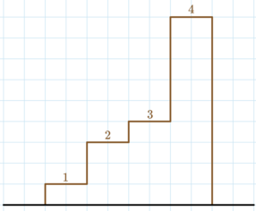

**Link to problem:** https://codeforces.com/contest/1742/problem/E

**Description:**

time limit per test : 3 second
memory limit per test : 256 megabytes
input : standard input
output : standard output

Timur has a stairway with n steps. The i-th step is ai meters higher than its predecessor. The first step is a1 meters higher than the ground, and the ground starts at 0 meters.  

    

Timur has q questions, each denoted by an integer k1,…,kq. For each question ki, you have to print the maximum possible height Timur can achieve by climbing the steps if his legs are of length ki. Timur can only climb the j-th step if his legs are of length at least aj. In other words, ki≥aj for each step j climbed.

Note that you should answer each question independently.

### Input

The first line contains a single integer t (1≤t≤100) — the number of test cases.

The first line of each test case contains two integers n,q (1≤n,q≤2⋅105) — the number of steps and the number of questions, respectively.

The second line of each test case contains n integers (1≤ai≤109) — the height of the steps.

The third line of each test case contains q integers (0≤ki≤109) — the numbers for each question.

It is guaranteed that the sum of n does not exceed 2⋅105, and the sum of q does not exceed 2⋅105.

### Output

For each test case, output a single line containing q integers, the answer for each question.

Please note, that the answer for some questions won't fit into 32-bit integer type, so you should use at least 64-bit integer type in your programming language (like long long for C++).

### Input

3
4 5
1 2 1 5
1 2 4 9 10
2 2
1 1
0 1
3 1
1000000000 1000000000 1000000000
1000000000

### Output

1 4 4 9 9 
0 2 
3000000000 

