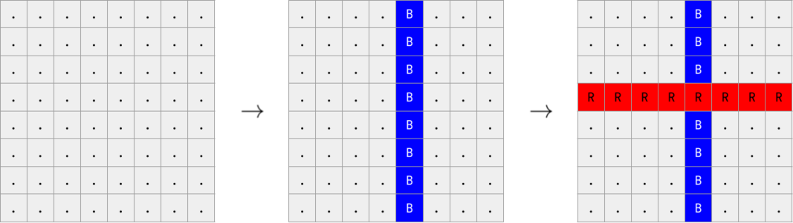

**Link to problem:** https://codeforces.com/contest/1742/problem/C

**Description:**

time limit per test : 1 second
memory limit per test : 256 megabytes
input : standard input
output : standard output

On an 8×8 grid, some horizontal rows have been painted red, and some vertical columns have been painted blue, in some order. The stripes are drawn sequentially, one after the other. When the stripe is drawn, it repaints all the cells through which it passes.

Determine which color was used last.

### Input

The first line of the input contains a single integer t (1≤t≤4000) — the number of test cases. The description of test cases follows. There is an empty line before each test case.

Each test case consists of 8 lines, each containing 8 characters. Each of these characters is either 'R', 'B', or '.', denoting a red square, a blue square, and an unpainted square, respectively.

It is guaranteed that the given field is obtained from a colorless one by drawing horizontal red rows and vertical blue columns.

At least one stripe is painted.

### Output

For each test case, output 'R' if a red stripe was painted last, and 'B' if a blue stripe was painted last (without quotes).
### Input

4

....B...
....B...
....B...
RRRRRRRR
....B...
....B...
....B...
....B...

RRRRRRRB
B......B
B......B
B......B
B......B
B......B
B......B
RRRRRRRB

RRRRRRBB
.B.B..BB
RRRRRRBB
.B.B..BB
.B.B..BB
RRRRRRBB
.B.B..BB
.B.B..BB

........
........
........
RRRRRRRR
........
........
........
........

### Output

R
B
B
R
