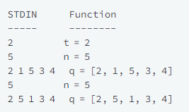
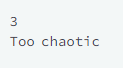

## Question

It is New Year's Day and people are in line for the Wonderland rollercoaster ride. Each person wears a sticker indicating their initial position in the queue from  to . Any person can bribe the person directly in front of them to swap positions, but they still wear their original sticker. One person can bribe at most two others.

Determine the minimum number of bribes that took place to get to a given queue order. Print the number of bribes, or, if anyone has bribed more than two people, print Too chaotic.

## Example

q = [1, 2, 3, 5, 4, 6, 7, 8]

If person  bribes person , the queue will look like this: . Only  bribe is required. Print 1.

q = [4, 1, 2, 3]

Person 4 had to bribe  people to get to the current position. Print Too chaotic.

## Input

The first line contains an integer , the number of test cases.

Each of the next  pairs of lines are as follows:
- The first line contains an integer , the number of people in the queue
- The second line has  space-separated integers describing the final state of the queue.

## Output

No value is returned. Print the minimum number of bribes necessary or Too chaotic if someone has bribed more than  people.

## Constraints

- 1 ≤ T ≤ 10

- 1 ≤ n ≤ 10^5

## Sample Input 1 

3

## Sample Output 1 

